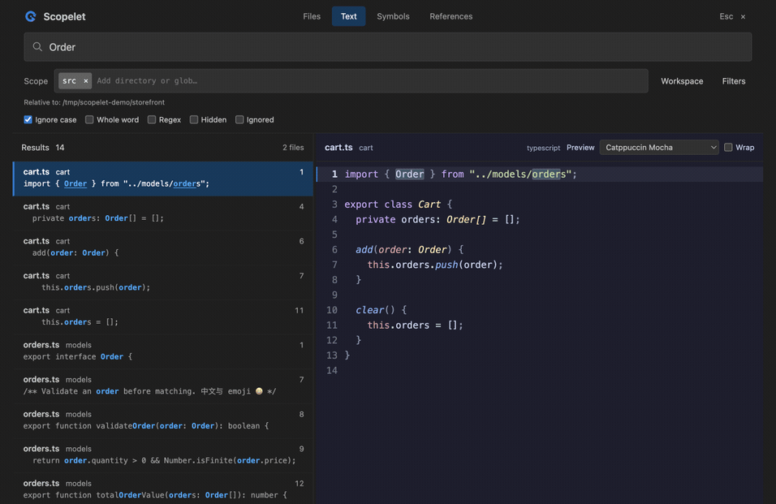
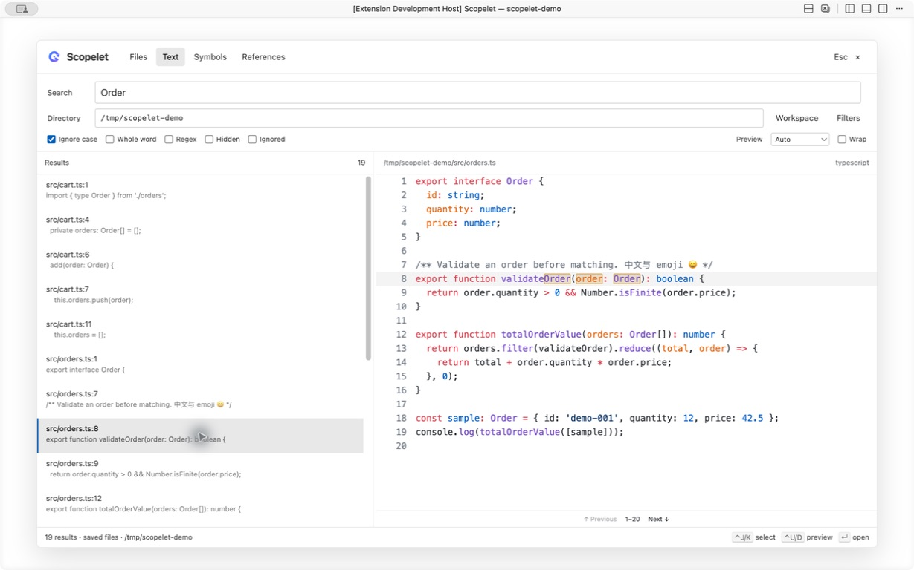
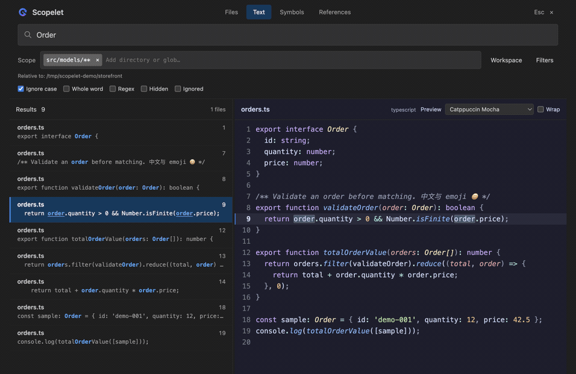

<p align="center">
  
</p>

# Scopelet

搜索工作区，无需离开编辑器即可就地预览匹配的代码。

[English](README.md) · **简体中文**

查找文件、搜索内容、浏览符号和引用，预览代码后再决定是否打开。

本页面介绍 Scopelet 的 VS Code 发行版本。[公开文档与问题反馈仓库](https://github.com/yanke1311/scopelet-public)仅包含文档和图片，插件实现源码当前保持私有。



*在 VS Code 示例项目中录制：搜索、键盘导航和 Scope/glob 筛选。[静态概览](assets/screenshots/search-dark.png)。*

<details>
<summary>浅色主题</summary>



</details>

## 功能

- **四种搜索模式**：文件名模糊搜索、文本搜索、当前文档符号、光标处符号引用。
- **控制搜索范围**：多目录/glob chip、范围组合历史、路径补全、可折叠的 Include/Exclude chip，以及大小写、整词、正则和多行字面搜索。
- **先预览再打开**：语法高亮、命中标记、独立预览主题、换行，以及大文件和超长行的有界预览。
- **键盘优先**：选择结果、滚动预览、打开命中位置、恢复来源编辑器选区；按工作区保存搜索历史与预览偏好。

## 环境与安装

需要支持 **VS Code API 1.126.0 或更高版本**的编辑器，以及受信任的文件系统工作区。符号和引用功能依赖相应语言扩展提供的能力。

当前已测试环境包括 **Apple Silicon Mac**，以及维护者已测试的 **Windows 和 WSL**。有记录的 macOS 验证包括 VS Code 1.136.2。WSL 以外的 Linux、Intel Mac、其他架构、SSH 与容器仍需验证。

扩展标识为 **`ke-yan.scopelet`**。可通过 **Extensions: Install from VSIX…** 安装对应平台的 VSIX；市场版本可用后，也可在 VS Code 扩展面板搜索安装 Scopelet。安装包针对以下扩展宿主：

| 扩展宿主 | 安装包目标 |
| --- | --- |
| Windows x64 | `win32-x64` |
| WSL x64 | `linux-x64`，安装到 WSL 窗口 |
| Apple Silicon Mac | `darwin-arm64` |

早期试用包的标识是 `scopelet-local.scopelet`，与新 ID 不同。切换到 `ke-yan.scopelet` 时请禁用或卸载旧试用扩展，避免命令重复；历史和扩展偏好不会自动迁移。之后相同 ID 的版本可直接覆盖安装，并按提示重新加载窗口。

## 快速上手

1. 打开项目和一个源文件。
2. 在命令面板运行 **Scopelet: Search Text** 或 **Scopelet: Find Files**。
3. 输入查询，选择结果并查看预览。
4. 按 **Enter** 打开结果，或按 **Esc** 返回原编辑器。

Scope 可添加多个目录或 glob，例如 `src` 和 `packages/*/src/**`。相对条目与筛选使用界面显示的 **Relative to** 基准。Scope 内按 Enter 或点击 **Apply** 应用修改；Include/Exclude 内按 Enter 添加 chip，Ctrl+Enter 应用筛选。粘贴多行时保留 `*.{ts,tsx}` 这类逗号表达式。Filters 默认折叠；原来的目录历史清理命令也会清理范围组合历史。

Recent scopes 显示完整路径，较长时自动换行。点击单条记录右侧的 **Remove**，或用方向键选中后按 **Shift+Delete**，即可删除该范围历史；不会改变当前搜索，也不会删除文件。

| 命令 | 用途 |
| --- | --- |
| `Scopelet: Find Files` | 按文件名模糊查找 |
| `Scopelet: Search Text` | 搜索目录或工作区中的文件内容 |
| `Scopelet: Search Selection or Word` | 带入选区或光标处单词，开始字面搜索 |
| `Scopelet: Document Symbols` | 浏览来源文档的符号 |
| `Scopelet: References at Cursor` | 查找来源光标处符号的引用 |

### 操作界面

- **Files / Text / Symbols / References**：切换搜索模式。
- **Directory**：设置搜索目录；**Workspace**：搜索工作区根目录。**Filters** 中每行填写一个包含或排除 glob，例如 `**/*.ts`、`**/vendor/**`。
- **Ignore case**：忽略大小写；**Whole word**：整词匹配；**Regex**：正则匹配。多行查询使用字面匹配。
- **Hidden**：包含隐藏文件；**Ignored**：包含被 `.gitignore` 等忽略规则排除的文件。两者独立，`.git` 元数据始终排除。
- 左侧为结果，右侧为选中结果的预览，拖动分隔线可调整宽度。**Preview** 与 **Wrap** 只影响预览，不改变编辑器主题或设置。
- 清空文本查询可查看历史；按 **Ctrl+Enter** 记住已完成的文本搜索，打开结果也会记住本次搜索。

文件和文本搜索读取**磁盘上的已保存文件**，不会自动保存你的编辑。预览可以显示已打开文档的未保存内容，并注明该状态，因此保存并重新搜索前，结果与预览可能不同。

### 键盘操作

下表快捷键在 Scopelet 面板内生效；macOS 中的 `Ctrl` 也是 Control 键。

| 按键 | 操作 |
| --- | --- |
| `Ctrl+J` / `Ctrl+K` | 下一条 / 上一条结果 |
| `Enter` | 打开结果、确认目录或恢复历史搜索 |
| `Ctrl+Enter` | 应用待确认筛选；否则记住已完成的文本搜索 |
| `Ctrl+U` / `Ctrl+D` | 预览上移 / 下移半页 |
| `Ctrl+Alt+H` / `Ctrl+Alt+L` | 横向滚动预览 |
| `Tab` / `Shift+Tab` | 切换控件 |
| `Esc` | 关闭 Scopelet 并恢复来源编辑器 |

插件不默认分配全局快捷键。可以将下例合并到编辑器的 `keybindings.json`：

```json
[
  { "key": "ctrl+alt+f", "command": "scopelet.findFiles", "when": "editorTextFocus" },
  { "key": "ctrl+alt+g", "command": "scopelet.searchText", "when": "editorTextFocus" }
]
```

<details>
<summary>可选 VSCodeVim 映射</summary>

合并到现有 VSCodeVim 设置，并替换冲突的旧映射：

```json
{
  "vim.leader": ",",
  "vim.normalModeKeyBindingsNonRecursive": [
    { "before": ["<leader>", "f", "f"], "commands": ["scopelet.findFiles"] },
    { "before": ["<leader>", "f", "g"], "commands": ["scopelet.searchText"] },
    { "before": ["<leader>", "f", "G"], "commands": ["scopelet.searchSelection"] },
    { "before": ["<leader>", "f", "s"], "commands": ["scopelet.documentSymbols"] },
    { "before": ["<leader>", "f", "w"], "commands": ["scopelet.references"] }
  ],
  "vim.visualModeKeyBindingsNonRecursive": [
    { "before": ["<leader>", "f", "G"], "commands": ["scopelet.searchSelection"] }
  ]
}
```

</details>

## 配置

在设置中搜索 **Scopelet**。常用配置及其默认值：

默认布局采用接近 0.1.7 的紧凑间距，结果文件名为 12px，辅助文字为 11px。

```json
{
  "scopelet.maxResults": 2000,
  "scopelet.maxFileCandidates": 100000,
  "scopelet.ui.fontSize": 12,
  "scopelet.preview.fontSize": 0,
  "scopelet.preview.theme": "auto",
  "scopelet.preview.wordWrap": false
}
```

`scopelet.ui.fontSize` 调整界面字号（11–20px，默认 12）；`scopelet.preview.fontSize` 独立调整代码预览字号（0 跟随 `editor.fontSize`，正数限制在 8–40px）。希望预览更紧凑可以设为 12。修改后关闭并重新打开 Scopelet 生效，不会改变编辑器字号。

提供 **65 套内置预览主题，加上 Auto**，包括 **Catppuccin** 全部四款（Latte、Frappé、Macchiato、Mocha），以及 Dracula、Tokyo Night、Gruvbox、Rosé Pine、Kanagawa、Ayu、GitHub、Nord、Monokai、Solarized、Material 等。预览下拉按明暗分组，也可通过 **Scopelet: Select Preview Theme** 搜索选择。



*只改变预览配色，不修改编辑器主题。*

主题随 VSIX 提供，选中时才读取对应本地文件，无需 CDN 或额外安装主题扩展。Auto 跟随编辑器明暗，高对比度模式优先保证可读性。面板中按工作区保存的选择优先于默认值；通过 **Scopelet: Reset Preview Preferences** 恢复默认。命令面板也提供清理搜索历史、目录历史或全部历史的操作。

可用 `scopelet.keybindings` 调整面板内快捷键，例如 `{ "next": "ctrl+n", "previous": "ctrl+p" }`。支持的操作与可选命中配色见设置项说明。

## 隐私与数据

Scopelet 在扩展宿主中处理你选择的文件和查询，按工作区保存搜索/目录历史及预览偏好，并提供清理和重置命令。插件没有开发者运营的数据上传服务或内置遥测。语言扩展、远端宿主、GitHub 文档和问题反馈各有独立的数据处理边界。具体内容及控制方式见[隐私说明](PRIVACY.md#简体中文)。

## 支持与反馈

请通过 [GitHub Issues](https://github.com/yanke1311/scopelet-public/issues)报告问题或提出建议，附上 VS Code 版本、系统与架构、复现步骤及不含敏感数据的最小示例。Issue 内容公开可见，提交前请移除凭据、个人信息、私有路径和专有代码。公开文档仓库不是可以编译运行的源码仓库。

## 许可证与致谢

[MIT](LICENSE)。第三方组件保留各自许可证，构建产物包含 `dist/THIRD_PARTY_NOTICES.txt`。

Scopelet 使用 [ripgrep](https://github.com/BurntSushi/ripgrep)、[Shiki](https://shiki.style/)、[fuzzysort](https://github.com/farzher/fuzzysort) 和 [picomatch](https://github.com/micromatch/picomatch)，交互灵感来自 [Telescope](https://github.com/nvim-telescope/telescope.nvim)。
